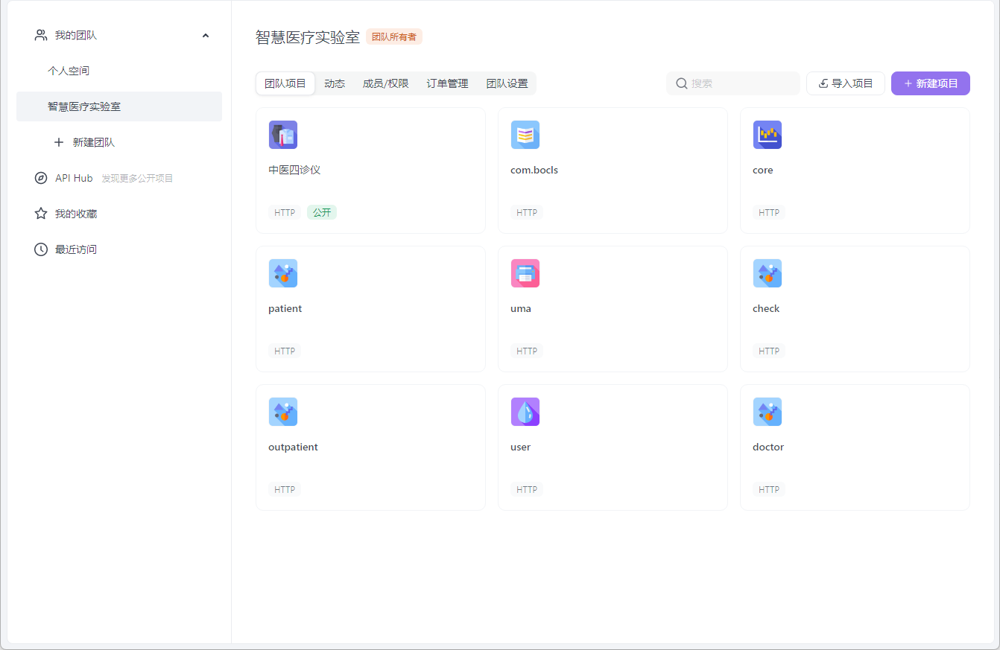
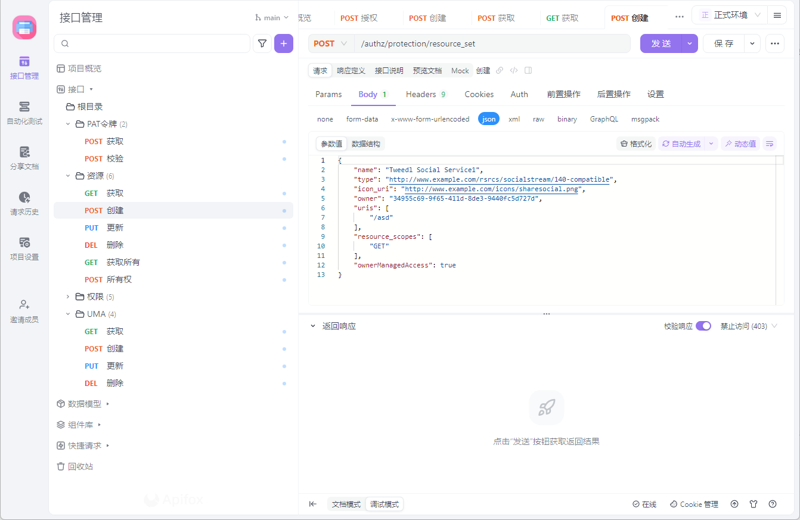
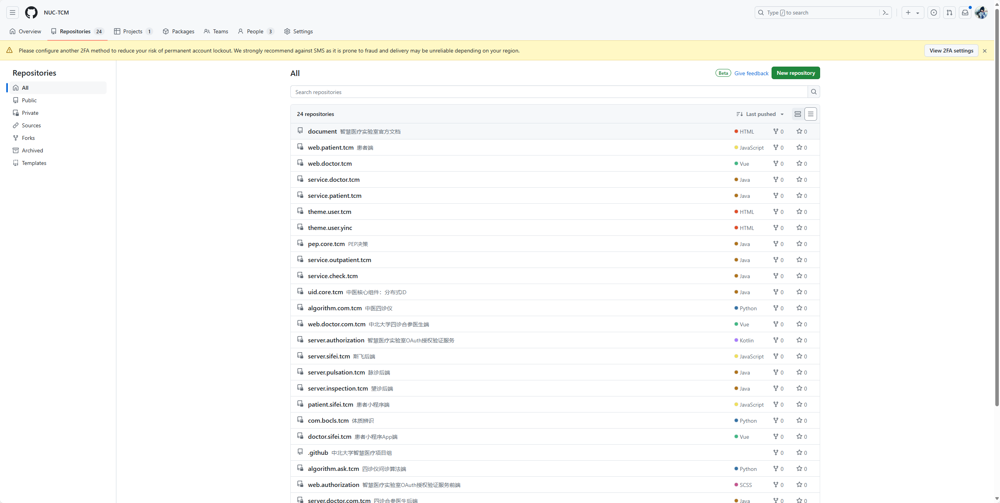
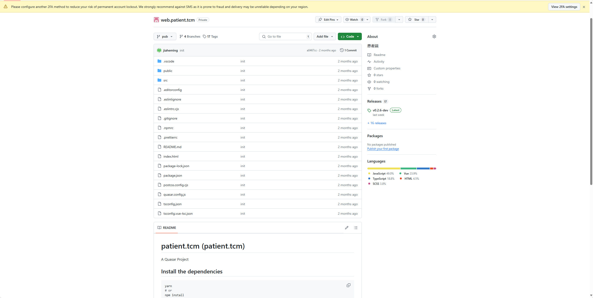
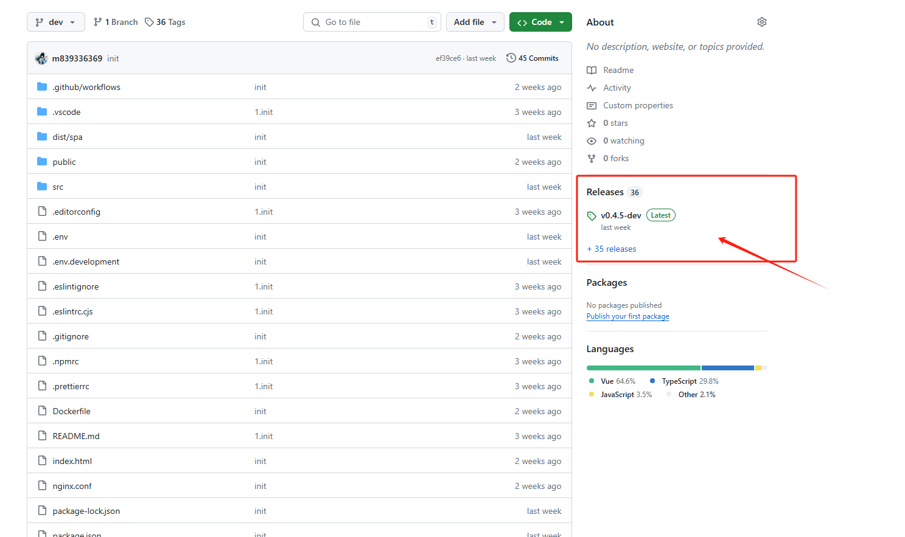
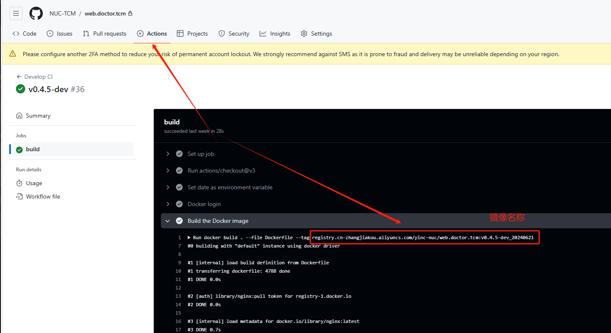
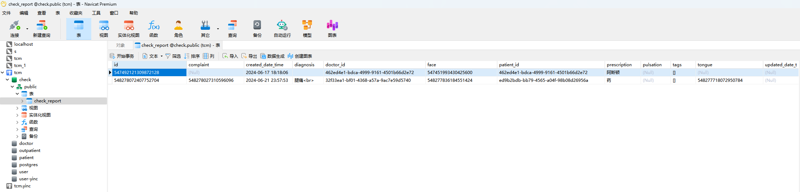
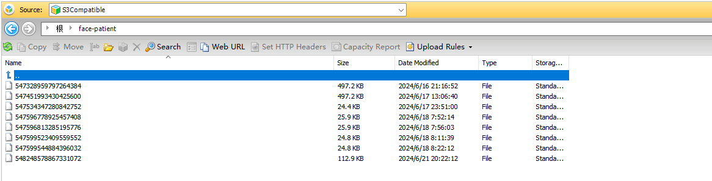

# 通用指南

## 项目资源

`项目文档` 用于维护项目接口规范

[`项目源码`](https://github.com/orgs/NUC-TCM) 用于团队协作版本控制

`项目数据` 用于保存用户数据状态

### 项目文档



### 项目源码





#### 自动化CI

##### 配置

项目源码应有.github根配置文件，用于配置Github仓库CI自动化部署流程。

`.github/workflows/ci.yml`

```yaml
name: Develop CI

on:
  release:
    types: [published]

env:
  APP_NAME: pep.core.tcm

jobs:
  build:
    runs-on: ubuntu-latest
    steps:
    - uses: actions/checkout@v3
    - name: Set date as environment variable
      run: echo "DATETIME=$(date +"%Y%m%d")" >> $GITHUB_ENV
    - name: Docker login
      uses: docker/login-action@v1
      with:
        username: ${{ vars.DOCKERHUB_USERNAME }}
        password: ${{ secrets.DOCKERHUB_PASSWORD }}
        registry: ${{ vars.DOCKERHUB_REGISTRY }}
        logout: true
    - name: Build the Docker image
      run: docker build . --file Dockerfile --tag ${{ vars.DOCKERHUB_REGISTRY }}/${{vars.DOCKERHUB_NAMESPACE}}/${{env.APP_NAME}}:${{github.event.release.tag_name}}_${{env.DATETIME}}
    - name: Docker image push
      run: docker push ${{ vars.DOCKERHUB_REGISTRY }}/${{vars.DOCKERHUB_NAMESPACE}}/${{env.APP_NAME}}:${{github.event.release.tag_name}}_${{env.DATETIME}}
```

##### 部署

当通过Releases发布项目后，在Action中将执行自动化脚本打包为独立容器





#### 版本命名规范

`v1.0.0-dev_{时间将有打包容器自动生成}`

`v1.0.0-pub_{时间将有打包容器自动生成}`

#### 分支管理

主分支：`dev` 、`pub`

### 项目数据

#### 数据库

提供Postgresql数据库，用于存储业务数据



#### 对象存储

提供`S3`协议的对象存储，用于存储科学数据



## 关于路由

严格上路由从顶级域名不断递进至正确服务`服务.面部.患者.中医.仪联中.中国`

但泛域名信任证书一般信任至三级域名，故后续路由可改为URI风格`中医.仪联中.中国/患者/面部/服务`

一般识别端点为`门户` 、`服务` 、`算法`，在端点之后为该端点具体业务。

```java
代表患者端点的服务类型 of 主诉
@RestController
@RequestMapping("/患者/服务/主诉")
public class ComplaintsController {
    @PutMapping(value = "/{id}")
    public ResponseEntity<Void> put(@PathVariable String id,@RequestBody Complaint Complaint){
        Complaint.setId(id);
        complaintService.put(Complaint);
        return ResponseEntity.ok().build();
    }
}
```

| 名称 | 英文      |
| ---- | --------- |
| 门户 | web       |
| 服务 | service   |
| 算法 | algorithm |

## 集群

### 环境

项目相关配置（`数据库地址`、`业务服务地址`等）应通过系统环境变量配置，在集群上线时运维人员将通过系统环境变量的形式直接提供对应配置信息。

```java
String path = System.getenv("PATH");
```

```python
path = os.environ.get('PATH')
```

```c#
string path = Environment.GetEnvironmentVariable("PATH");
```

### 网络

网络环境可分为两类`外网访问` `内网访问`

一般用于实验测试使用外网访问，当项目上线时，运维人员将进行内网环境配置，内网通讯带宽远大于外网，可忽略带宽限制问题。

